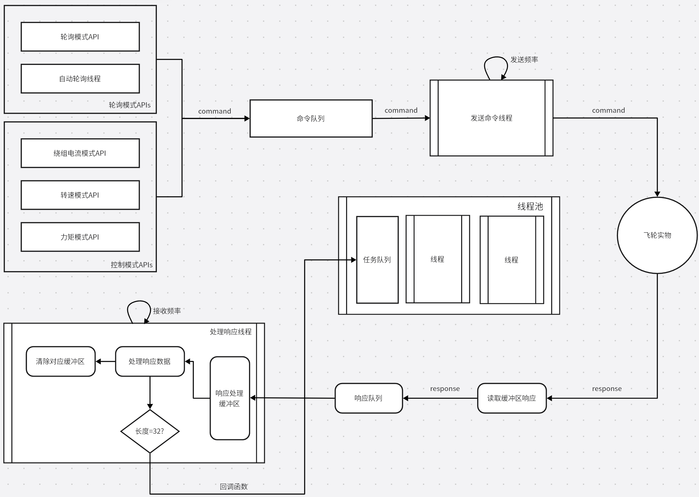

# PyFlyWheel

PyFlyWheel is a python module that provides a simple interface to the FlyWheel experiment.

## framework



## install

the module has not been published to pypi, so you need to install it manually. The subdirectory pyflywheel is the module, which should be moved to the python module path or working directory.


## usage

The FlyWheel class is the core class of the module, which provides some basic APIs to control the flywheel. Moreover, it provides a callback function for user to achieve more complex functions. The params of the callback function are set to the telemetry data at the current timestamp and last timestamp.

At the beginning, one needs to initialize a FlyWheel with the necessary parameters: port and baudrate. Some additional parameters are optional, such as the callback function, the queue size, the thread frequency, the max telemetry size, the auto polling, and the communication frequency.

The control mode of the flywheel contains three modes: speed control, torque control and current control. One can achieve the speed control by using the API `set_speed`, the torque control can be achieved by using the API `set_torque`, and the current control achieved by the `set_current` API.

$\textbf{NOTE}$: the communication frequency and the polling frequency are different. The communication frequency is the frequency of the communication thread that receives command from a deque and sends the command to the flywheel, while the polling frequency is the frequency of the polling thread that sends polling command to the deque, and then sends to the flywheel in the communication thread.


A simple example is shown below:
```python
from pyflywheel.core import FlyWheel

flywheel = FlyWheel(port='COM5', baudrate=115200)
flywheel.connect()
flywheel.start()

# do something

flywheel.set_speed(1000)
time.sleep(3)

flywheel.set_speed(0)
time.sleep(1)

flywheel.stop()
flywheel.disconnect()
```
